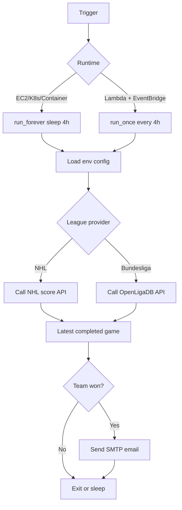

# should-i-watch-the-game

Minimal Python notifier that checks if a team won and emails a "you should watch" alert every 4 hours.

## Features (v1)
- Leagues: **NHL**, **Bundesliga**.
- Modular providers (`winwatch/providers/*`) for easy league expansion.
- SMTP email notification.
- Docker + local Python + AWS Lambda run modes.

## Quick start
1. Copy env file:
   ```bash
   cp .env.example .env
   ```
2. Fill `.env` values.
3. Run with Docker:
   ```bash
   docker compose up -d --build
   ```

### Local Unix run
```bash
python -m venv .venv
source .venv/bin/activate
pip install -e .
set -a && source .env && set +a
python -m winwatch.main
```


## GitHub Actions schedule
A ready workflow is included at `.github/workflows/winwatch-schedule.yml`.

- Runs every 4 hours plus manual trigger (`workflow_dispatch`).
- Configured target: `LEAGUE=nhl`, `TEAM=Colorado Avalanche`, `EMAIL_TO=k3o2izccf@mozmail.com`.
- Executes one check using `python -m winwatch.once`.

Set these repository secrets before enabling the workflow:
- `SMTP_HOST`
- `SMTP_PORT`
- `SMTP_USER`
- `SMTP_PASSWORD`
- Optional: `EMAIL_FROM` (defaults to `SMTP_USER` if omitted).

The workflow is configured to force JavaScript actions to Node 24 (`FORCE_JAVASCRIPT_ACTIONS_TO_NODE24=true`) to avoid Node 20 deprecation issues.

After adding secrets, go to **Actions -> WinWatch Schedule -> Run workflow** once to validate delivery.

## AWS Lambda mode
Use handler: `winwatch.lambda_handler.handler`

- The core logic is unchanged (`run_once` / providers / notifier) and reused by Lambda.
- When running in Lambda, config loading checks `LAMBDA_*` env vars first, then falls back to base env names.
- Schedule with EventBridge: `rate(4 hours)`.

## How it works


## Extension points
- Add a new league provider implementing `LeagueProvider.latest_result`.
- Add qualifiers (OT, playoffs) inside provider payload parsing or a future rule engine.
- Add frontend + SMS as independent modules calling the same service layer.

## Notes
- Current Bundesliga lookup scans recent matchdays and returns the latest finished match found for the target team.
- For cloud use, run the same container on any scheduler (ECS, Kubernetes CronJob, VPS with Docker), or run Lambda on EventBridge.


## Failure conditions
- If SMTP credentials are invalid or provider blocks SMTP login, email delivery will fail for that run.
- If score APIs are temporarily unavailable, the run logs a provider error and exits without notification.
- If no completed game is found or the team did not win, no email is sent (expected behavior).
