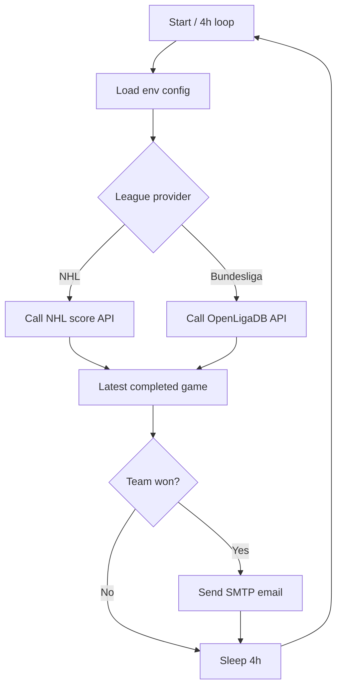

# should-i-watch-the-game

Minimal Python notifier that checks if a team won and emails a "you should watch" alert every 4 hours.

## Features (v1)
- Leagues: **NHL**, **Bundesliga**.
- Modular providers (`winwatch/providers/*`) for easy league expansion.
- SMTP email notification.
- Docker + local Python run modes.

## Quick start
1. Copy env file:
   ```bash
   cp .env.example .env
   ```
2. Fill `.env` values.
3. Run with Docker:
   ```bash
   docker compose up -d --build
   ```

### Local Unix run
```bash
python -m venv .venv
source .venv/bin/activate
pip install -e .
set -a && source .env && set +a
python -m winwatch.main
```

## How it works


## Extension points
- Add a new league provider implementing `LeagueProvider.latest_result`.
- Add qualifiers (OT, playoffs) inside provider payload parsing or a future rule engine.
- Add frontend + SMS as independent modules calling the same service layer.

## Notes
- Current Bundesliga lookup scans recent matchdays and returns the latest finished match found for the target team.
- For cloud use, run the same container on any scheduler (e.g., ECS, Cloud Run jobs, Fly, VPS with Docker).
